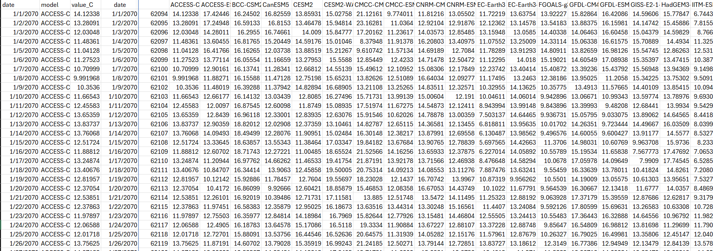
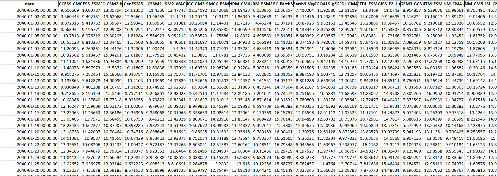
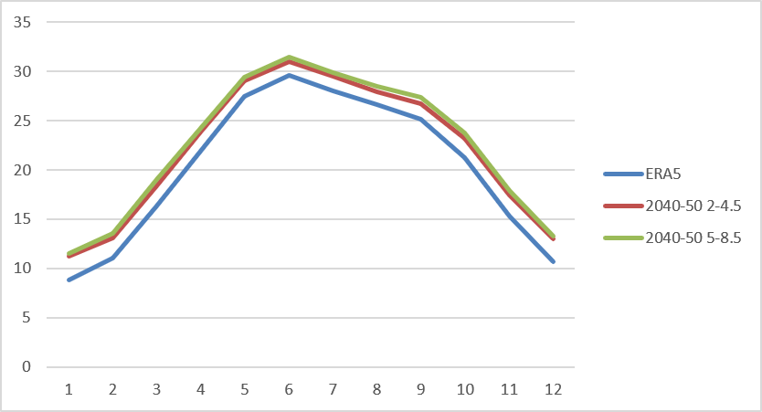
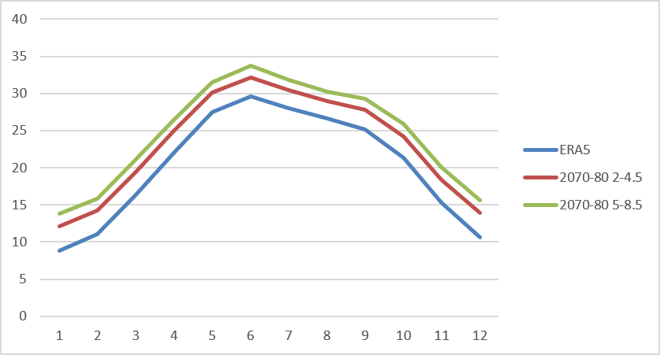
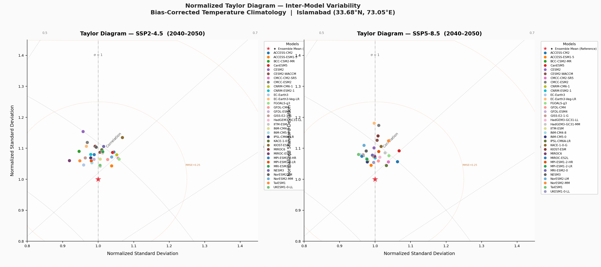
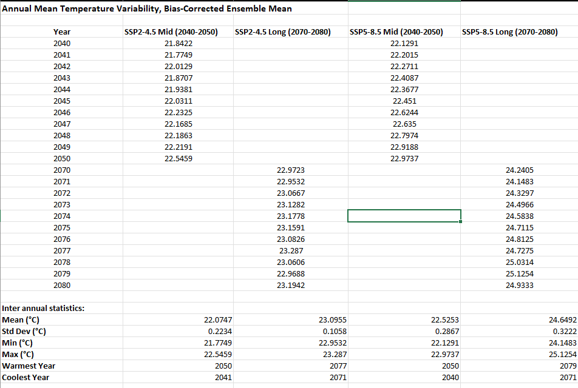
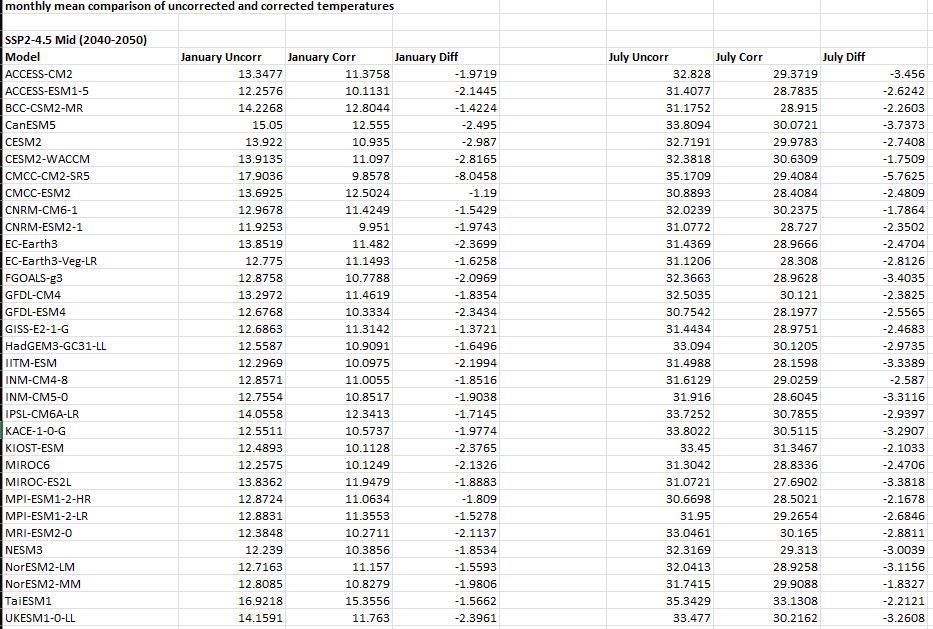
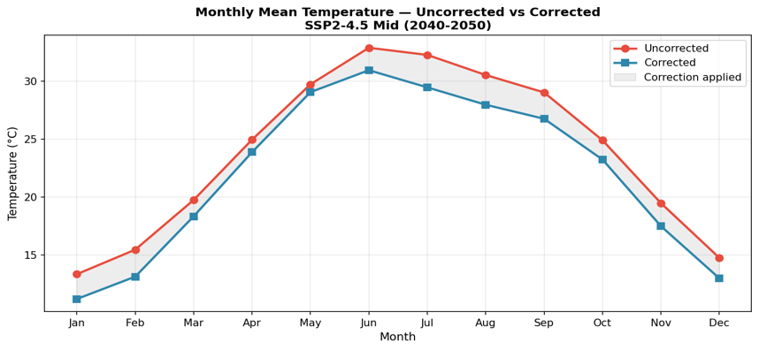
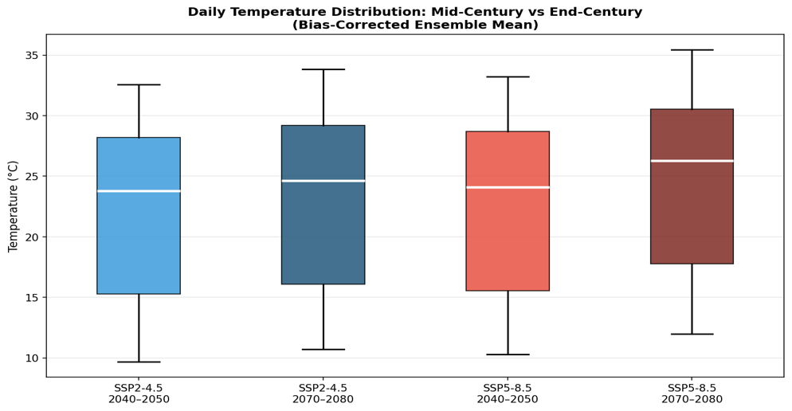
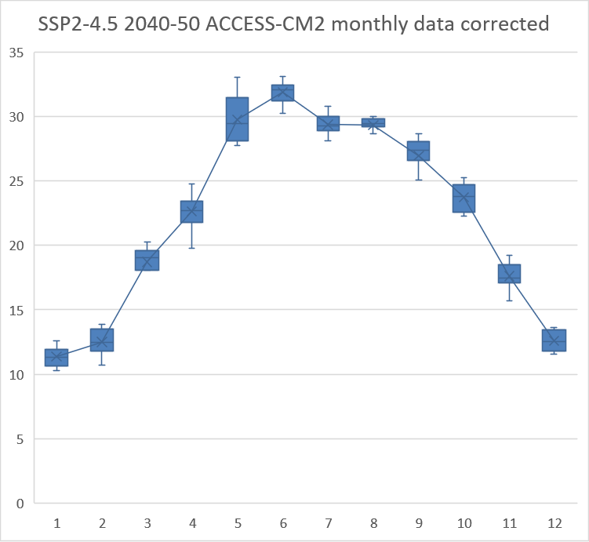

# CMIP6 Climate Scenario Projections for Islamabad, Bias-Corrected Temperature Analysis (SSP2-4.5 & SSP5-8.5)

A Google Earth Engine and Python workflow that extracts, bias-corrects, and compares daily CMIP6 temperature projections for a single grid cell over Islamabad, Pakistan, to quantify mid- and end-century warming under moderate and high-emissions scenarios.

---

## Motivation

To understand how climate impact studies at a specific location need more than raw GCM output, raw CMIP6 models carry biases that can distort projected warming by several degrees. This project answers a concrete question: **how much warmer will Islamabad get by mid-century (2040–2050) and end-century (2070–2080) under a moderate (SSP2-4.5) versus a high-emissions (SSP5-8.5) pathway**, once model bias is corrected against real observations. This kind of grid-cell-level, bias-corrected, multi-model analysis is a common first step in climate risk and impact assessment work. Some steps like the creation of a Taylor model were performed to give an introduction to concepts as this was an educational project.

---

## What This Project Does

- Defines a single 0.25° × 0.25° grid cell centred on Islamabad (33.6844°N, 73.0479°E) as the study point.
- Pulls **daily temperature data from all 34 CMIP6 GCMs** in the NASA NEX-GDDP-CMIP6 collection, for two future scenarios (SSP2-4.5, SSP5-8.5) and two future decades (2040–2050, 2070–2080).
- Pulls matching **historical GCM runs (1998–2015)** and **ERA5-Land hourly reanalysis (1998–2015)** as an independent observational reference.
- Reconstructs missing daily-mean temperature values from `tasmax`/`tasmin` where needed, and converts all values from Kelvin to Celsius.
- Restructures the exported long-format CSVs into wide-format matrices (date × model) in Excel using built-in formulas.
- Applies a **monthly change-factor bias correction** to every GCM's future projections, using ERA5-Land (2000–2010) as the baseline reference.
- Builds a **multi-model ensemble mean** from the corrected outputs for each scenario/period.
- Evaluates **inter-model spread** with a normalized Taylor diagram (mid-century, both scenarios).
- Compares **monthly climatologies** of the bias-corrected ensemble against the ERA5 baseline to quantify seasonal warming.
- Visualizes seasonal spread with a **box-and-whisker plot** and assesses **inter-annual variability** within each decade.

---

## Data / Tools Used

- **NASA NEX-GDDP-CMIP6:** (Google Earth Engine collection), bias-corrected, statistically downscaled daily CMIP6 GCM output, 0.25° resolution, 1950–2100, 34 models.
- **ECMWF ERA5-Land (Hourly):** — observational/reanalysis reference dataset, ~9 km resolution.
- **Google Earth Engine:** data extraction and point-based spatial reduction.
- **Microsoft Excel and (Python) Jupyter Notebook:** `pandas` for bias correction and climatology calculations, `matplotlib` and `numpy` for the Taylor diagram and other plots.
- **Google Drive:** export destination for raw CSV time series from GEE.

---

## Excel Outputs

Before running the Python scripts, the following Excel files must be prepared by the user from the raw GEE CSV exports. Each file and its required sheet structure is described below.

### `Historic Data`
Constructed from the two raw historical GEE exports (NASA GDDP historical and ERA5-Land hourly).

| Sheet Name | Contents |
|---|---|
| `Data` | Wide-format daily matrix: rows = dates (2000–2010 baseline), columns = ERA5 mean + each CMIP6 model. ERA5 hourly values averaged to daily using `AVERAGEIF()` grouped by date. Model values pivoted from long-format CSV using `PIVOTBY()`. |
| `Uncorrected Monthly Mean` | Monthly mean temperature for each model and ERA5 over the baseline period. 12 rows (months 1–12), one column per model + ERA5. Calculated using `AVERAGEIF()` with a helper month column. |
| `Factors` | Change factor per model per month. Calculated as `ERA5 monthly mean - Model monthly mean`. 12 rows × 34 model columns. These are the correction offsets applied to future projections. |

---

### `Future Data`
Constructed from the two raw future GEE CSV exports (SSP2-4.5 and SSP5-8.5), pivoted and filtered into four sheets.

| Sheet Name | Contents |
|---|---|
| `sorted mid 2-4.5` | Wide-format daily matrix for SSP2-4.5, 2040–2050. Rows = dates, columns = model names. |
| `sorted long 2-4.5` | Wide-format daily matrix for SSP2-4.5, 2070–2080. |
| `sorted mid 5-8.5` | Wide-format daily matrix for SSP5-8.5, 2040–2050. |
| `sorted long 5-8.5` | Wide-format daily matrix for SSP5-8.5, 2070–2080. |

> **Note:** Here mid means 2040-2050 (mid term) and long means 2070-2080 (long term) climatologies. Each sheet should have a date column as the first column, followed by one column per CMIP6 model. The sheet headers should begin on row 3 (rows 1–2 are used for descriptive labels such as "Temperature (°C)" and "Modelled") to match the `header=2` argument used in the Python scripts. If your layout differs, adjust the `header` parameter accordingly.

---

### `Corrected Future Temperature Data`
Generated by running `apply_change_factor.py`. The script reads from `historic_data.xlsx` (factors sheet) and `future_data.xlsx` and writes the bias-corrected output. After running, Script 1 (`script1_ensemble_monthly.py`) adds the following sheets automatically:

| Sheet Name | Contents |
|---|---|
| `sorted mid 2-4.5` | Bias-corrected daily values, SSP2-4.5 2040–2050, with `Ensemble_Mean` column added. |
| `sorted long 2-4.5` | Bias-corrected daily values, SSP2-4.5 2070–2080, with `Ensemble_Mean` column added. |
| `sorted mid 5-8.5` | Bias-corrected daily values, SSP5-8.5 2040–2050, with `Ensemble_Mean` column added. |
| `sorted long 5-8.5` | Bias-corrected daily values, SSP5-8.5 2070–2080, with `Ensemble_Mean` column added. |
| `Ensemble_Monthly_Means` | Monthly means of the ensemble mean for all four scenario/period combinations. 12 rows × 4 columns. Used as the Taylor diagram reference. |
| `Monthly_mid_2-4.5` | Monthly mean per model, SSP2-4.5 2040–2050. 12 rows × 34 model columns. |
| `Monthly_long_2-4.5` | Monthly mean per model, SSP2-4.5 2070–2080. |
| `Monthly_mid_5-8.5` | Monthly mean per model, SSP5-8.5 2040–2050. |
| `Monthly_long_5-8.5` | Monthly mean per model, SSP5-8.5 2070–2080. |



---

## Methods

1. **Point extraction**: Daily `tas` (or `(tasmax + tasmin) / 2` where `tas` was unavailable) was extracted at the study point for all 34 GCMs, for both scenarios and both future decades, plus historical runs (1998–2015) and ERA5-Land hourly data (1998–2015, later aggregated to daily means).
2. **Restructuring**: Long-format daily records (one row per model per date) were pivoted into wide-format matrices (one row per date, one column per model) for each of the four scenario/period combinations.
3. **Bias correction (change-factor method)**: Monthly mean temperatures were computed for each GCM and for ERA5-Land over a common 2000–2010 baseline. The monthly change factor (`ERA5 monthly mean - GCM monthly mean`) was computed per model per month, then added to that model's future daily values for the matching calendar month:
   > `Corrected temp = Daily future temp + Monthly change factor`
4. **Ensemble construction**: The corrected daily values were averaged across all available models per day to produce a multi-model ensemble mean, and monthly climatologies (12 values per model per scenario/period) were derived from these.
5. **Inter-model variability**: A normalized Taylor diagram (standard deviation, Pearson correlation, centred RMSE, all normalized to the ensemble mean) was built for the mid-century period under both scenarios. No models were excluded, since literature-backed rejection thresholds were outside the project's scope.
6. **Climatology comparison**: Ensemble monthly climatologies for each scenario/period were compared against the ERA5 2000–2010 baseline to derive monthly and seasonal warming signals.
7. **Variability checks**: A box-and-whisker plot built for each climatology and one from one model's corrected daily values (ACCESS-CM2, SSP2-4.5, 2040–2050, monthly grouping) illustrated decadal and monthly daily spread as an introductory exploration of decadal and seasonal variability. Year-by-year annual means were also computed for each decade to check inter-annual stability across the full ensemble.

---

## Results / Key Findings
For study area: 
Latitude 33.6844°N, longitude 73.0479°E


| Scenario | Period | Ensemble Mean (°C) | Warming above ERA5 (°C) |
|---|---|---|---|
| SSP2-4.5 | 2040–2050 | 22.03 | ~+1.3 to +2.3 (monthly range) |
| SSP2-4.5 | 2070–2080 | 23.06 | ~+2.5 to +3.3 |
| SSP5-8.5 | 2040–2050 | 22.49 | ~+1.8 to +2.7 |
| SSP5-8.5 | 2070–2080 | 24.61 | ~+3.3 to +5.0 |

Monthly means against baseline comparison:



- All four scenario/period combinations show consistent warming above the ERA5 baseline across **every calendar month**, with winter months (Dec–Feb) showing some of the largest relative increases.
- The gap between SSP2-4.5 and SSP5-8.5 is modest at mid-century but widens to **~1.5–1.7°C** in individual months by 2070–2080.
- The Taylor diagram shows CMIP6 models clustering tightly around the ensemble mean (normalized std. dev. ~0.9–1.2) for both scenarios, indicating low inter-model uncertainty in the seasonal cycle at this location.

- Inter-annual variability within each decade is low (std. dev. 0.11°C–0.32°C), confirming decadal means are stable and not driven by outlier years.

- Raw (uncorrected) GCM output carried systematic warm biases of **1.4°C to 8.0°C** relative to ERA5-Land depending on model and month. The time series plot offered insight on the change between corrected and uncorrected values but side by side value comparison offered more information than the chart so those were used instead.



Box and whisker plots:



---

## Future Work

Several extensions could meaningfully strengthen this analysis:

- **Observational validation with ground station data**: Incorporating Pakistan Meteorological Department (PMD) station records alongside ERA5-Land would provide a more robust observed baseline, particularly given ERA5's known uncertainties over complex terrain such as the Margalla Hills immediately north of Islamabad.
- **APHRODITE gridded data**: Adding the APHRODITE high-resolution gridded dataset as a secondary observational reference would allow cross-validation of the ERA5 baseline and improve confidence in the change factors.
- **Literature-based model screening**: Applying published GCM performance thresholds to the Taylor diagram, for example, rejecting models with correlation below 0.90 or normalized standard deviation outside 0.7–1.3 would produce a screened ensemble and reduce the influence of poorly performing models on the ensemble mean.
- **Precipitation extension**: Extending the same bias correction and ensemble workflow to precipitation variables would enable compound temperature-precipitation impact analysis, relevant for water resource and agricultural planning.
- **Extreme value analysis**: Applying the block maxima method (Generalized Extreme Value distribution) to the corrected daily temperature series would quantify projected changes in return periods for extreme heat events, which is of direct relevance to urban heat and public health risk assessment.
- **Spatial extension**: Replicating the analysis across a spatial grid rather than a single point would produce spatially distributed warming maps for the wider Islamabad, Rawalpindi region, capturing urban heat island gradients, etc.
- **Full ensemble box-and-whisker**: Extending the seasonal box-and-whisker analysis from the single model demonstration (ACCESS-CM2) to the full corrected ensemble would better represent the spread of projected temperature distributions across months and scenarios.

---

## Limitations

- Bias correction uses a simple **additive monthly change-factor** method, it corrects the mean but does not adjust variance, extremes, or the shape of the daily distribution.
- Only **one grid cell** (single point) is analyzed; results are not necessarily representative of the wider Islamabad region or nearby terrain.
- No models were statistically rejected from the ensemble, literature-backed performance thresholds for CMIP6 model screening were not applied, so all models contribute equally to the ensemble mean regardless of individual performance.
- The historical baseline period (2000–2010) is relatively short for climatological baselines; a 30-year baseline is standard practice but it was taken on purpose to observe precise changes.
- ERA5-Land is a reanalysis product rather than direct ground observation and carries its own uncertainties, especially in complex terrain.
- Only **temperature** is analyzed, no precipitation, humidity, or compound-extremes assessment since this was an introductory project for the various concepts in use.
- The box-and-whisker plot demonstrates within-month daily spread for **one model only** (ACCESS-CM2, SSP2-4.5, 2040–2050) as an introductory exploration; full ensemble spread across months was not computed.

---

## How to Run It

This is a two-stage workflow: Earth Engine data extraction, then local processing in Excel and Python.

### Stage 1: Data Extraction (Google Earth Engine)
- Requires a Google Earth Engine account with access to `NASA/GDDP-CMIP6` and `ECMWF/ERA5_LAND/HOURLY`.
- Run `future_data.js` to extract future daily point values for SSP2-4.5 and SSP5-8.5 (2040–2050 and 2070–2080).
- Run `historic_data.js` to extract historical NASA GDDP daily values and ERA5-Land hourly values (1998–2015).
- Both scripts export CSV files directly to Google Drive.

### Stage 2: Pre-Processing (Excel)
- Import the exported CSVs into Excel.
- Use `YEAR()`, `MONTH()`, `DAY()`, `PIVOTBY()`, and `AVERAGEIF()` to reshape long-format exports into wide-format date × model matrices.
- Construct `historic_data.xlsx` and `future_data.xlsx` as described in the **Excel Outputs** section above.

### Stage 3: Bias Correction and Analysis (Python)
Install dependencies: 
```bash
pip install pandas matplotlib numpy openpyxl jupyterlab
```
ipynb
Run notebooks in this order:

| Script | What it does |
|---|---|
| `corrected_data.ipynb` | Reads change factors from `historic_data.xlsx` and applies them to all four future sheets, producing `corrected future temp.xlsx` |
| `script1_ensemble_taylors_plot.ipynb` | Adds ensemble mean column to each corrected sheet; creates monthly mean sheets and ensemble monthly mean reference sheet |
| `script2_ensemble_taylors_plot.ipynb` | Generates normalized Taylor diagrams for SSP2-4.5 and SSP5-8.5 (2040-2050) |
| `temporal_analysis.ipynb` | Generates monthly comparison table, time series plot, box-and-whisker plot (decadal), and annual variability table, all exported to `temporal_analysis.xlsx` |

---

## License

MIT License, free to use, modify, and distribute with attribution.